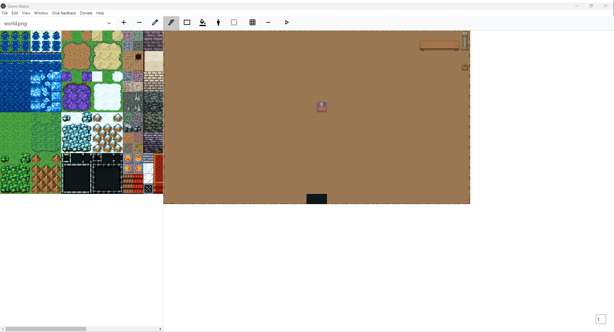

# Game Maker



(The screenshot is a little bit outdated.)

## Features

- Map editor
  - Tools
    - Pen
    - Area
    - Fill
    - Select
      - Cut
      - Cut and paste
      - Copy and paste
  - Large tile maps
  - Multiple levels (layers)
  - Multiple tile sets
  - Undo
  - Export and import from JSON
  - Automatic saving (in browser storage)
  - Keybindings
  - Toggle grid
  - Toggle: render only current level
  - Zooming

## Keyboard shortcuts

- Increment level: Ctrl + Arrow up
- Decrement level: Ctrl + Arrow down
- Delete selected tiles: Backspace or delete
- Moving the map: hold space and move the mouse.

There are more shortcuts, which are documented in the titles of the GUI elements (just hover over the GUI element to display the shortcut if it has one).

## Running it on your computer

### Prerequisites

- Node.js

### Installation

```bash
git clone https://github.com/SanjoSolutions/game-maker.git
cd game-maker
npm install
```

### Running

```bash
npm run start
```
